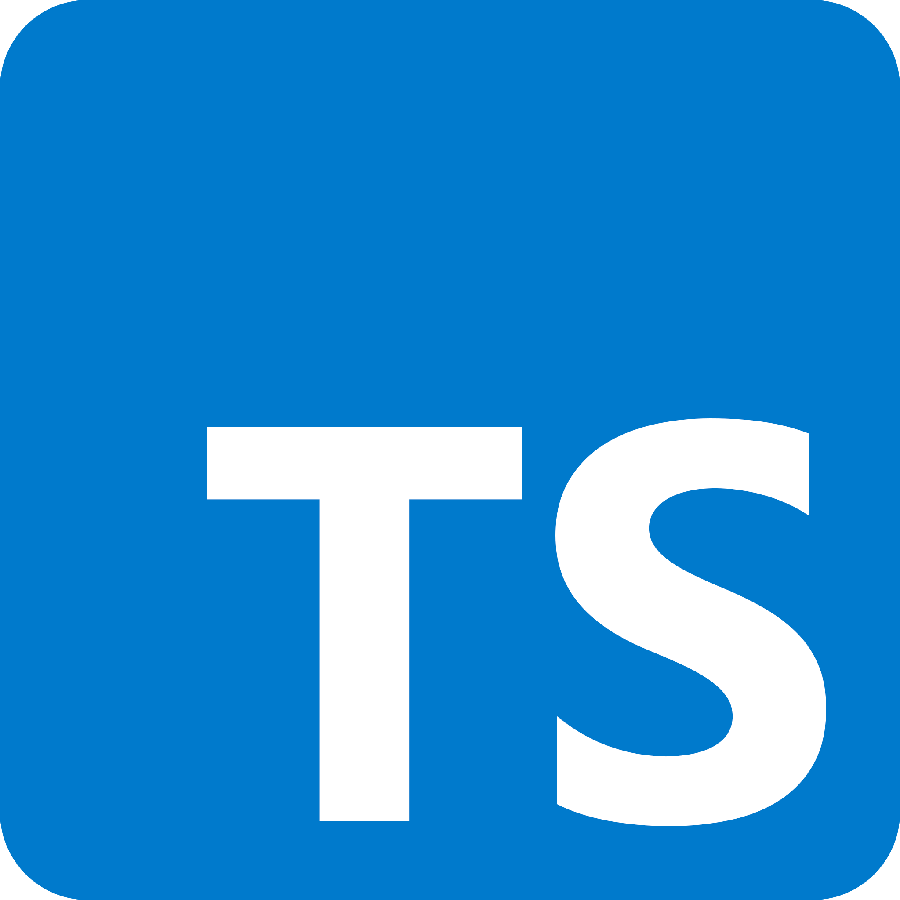

<p align="center">
  <a href="http://coldclimate.com/" target="blank"></a>
</p>


<p align="center">
<span style="font-size: xx-large"> </span>
<a href="http://coldclimate.com/" target="blank"></a>&nbsp;&nbsp;
<a href="http://coldclimate.com/" target="blank"></a>&nbsp;&nbsp;
<a href="http://coldclimate.com/" target="blank"></a>&nbsp;&nbsp;
<a href="http://coldclimate.com/" target="blank"></a>&nbsp;&nbsp;
<a href="http://coldclimate.com/" target="blank"></a>&nbsp;&nbsp;
<a href="http://coldclimate.com/" target="blank"></a>&nbsp;&nbsp;
<a href="http://coldclimate.com/" target="blank"></a>&nbsp;&nbsp;
</p>

### ✨ **This monorepo has been generated by [Nx](https://nx.dev) a Smart, fast and extensible build system.** ✨

#### The following applications and libraries are included in this monorepo:

- /apps/cold-ui - The frontend application for the Cold Climate APP. This is a React application written in Typescript
  using the react framework.
    - [/libs/react](https://github.com/ColdPBC/cold-monorepo/tree/main/libs/react/README.md) - The Cold Climate REACT
      Component Library

- [/apps/cold-api](https://github.com/ColdPBC/cold-monorepo/tree/main/apps/cold-api/README.md) - The Cold Climate REST
  API
    - [/libs/nest](https://github.com/ColdPBC/cold-monorepo/tree/main/libs/nest/README.md) - The Cold Climate Shared
      Microservice Library

# Troubleshooting

## UI: Build

- `yarn: command not found`
    - flightcontrol.dev UI build fails with an error:
      ```
         6:43:21 PM #11 [ 7/10] RUN  yarn prebuild && yarn dlx nx build cold-ui:build:development
         6:43:21 PM #11 sha256:de51b5d92e3e08950b5d940e9e15dc33ebe9b860d501bec10328dcc547964456
         6:43:21 PM #11 0.266 /bin/bash: line 1: yarn: command not found
      ```
  This is due to flight control not being able to locate the yarn.lock file. This is typically caused by an incorrect
  value for `basePath`. Make sure you have the path to the yarn.lock file relative to where the `flightcontrol.json`
  file. For example, if both file reside in the project root, then the basePath should be: `.`'

## Canvas Package

If you have trouble with the canvas package dependency on Apple silicon, you might need to build it from source.
See [here](https://github.com/Automattic/node-canvas/).

### Running the APP locally

## Redis Server

This repo includes two  `docker-compose` files to help you easily run all the dependent services:

**docker-compose.yml** :
Use this file to start only the Redis, Rabbit, Postgres and Proxy server ; this is useful if you want to debug the API
server locally.

Execute the following command:

  ```bash
  $  docker compose up
  ```

**docker-compose-core.yml** :
Use this file to start all services; this is useful if you are primarily working on the frontend and just want
a `no-fuss` way to run the backend services in the background.

Execute the following command:

  ```bash
  $   docker compose -f docker-compose-core.yml up
  ```

## UI Server

To start the development server run `nx serve cold-ui`. Open your browser and navigate to http://localhost:4200/

```bash
$ nx serve cold-ui
```

## API Documentation

### View Swagger/OpenAPI Documentation

- Run the app using any of the above scripts
- Navigate to http://localhost:7001/v1 to view the Swagger/OpenAPI documentation.
